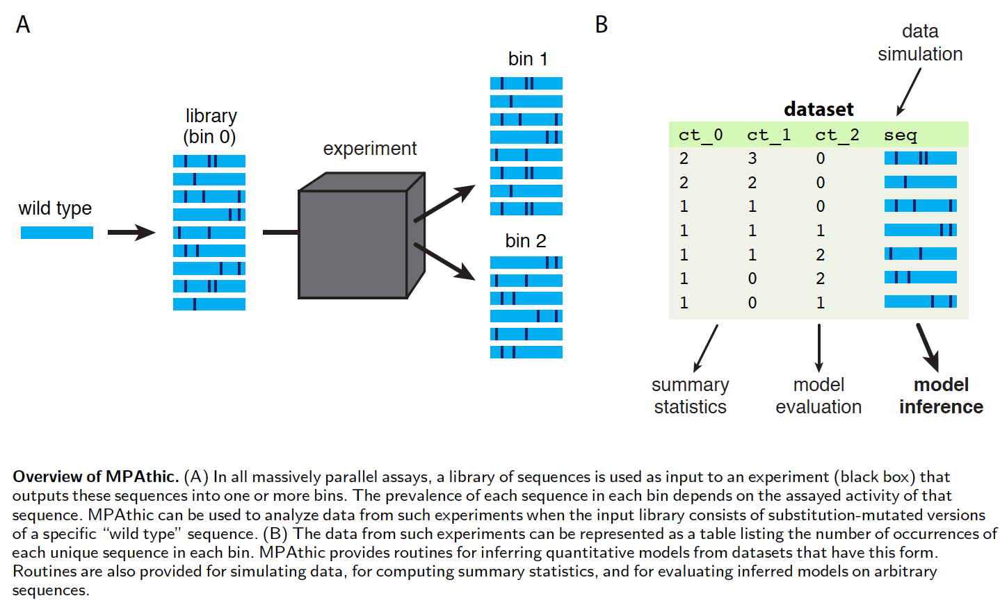

.. mpathic documentation master file, created by
   sphinx-quickstart on Mon Apr 23 09:37:52 2018.
   You can adapt this file completely to your liking, but it should at least
   contain the root `toctree` directive.

========
MPAthic
========

*Written by William Ireland, Ammar Tareen, and Justin B. Kinney.*

.. raw:: html

    <h1>Under Active Development</h1>
    

MPAthic is a python API and it fits quantitative models to data.
Most MPAthic classes take in one or more tabular text files as input and return a tabular text file as output.
All input and output files are designed to be human readable. The first line of each tabular text file contains
headers describing the contents of each column. All input files are required to have the proper set of
columns, which of course depend on the command being executed. By default, input is taken from the standard
input and output is written to the standard output.

Installation
------------

MPAthic can be installed from
`PyPI <https://pypi.python.org/pypi/mpathic>`_ using the pip package
manager (version 9.0.0 or higher). At the command line::

    pip install mpathic

The code for MPAthic is open source and available on
`GitHub <https://github.com/atareen/mpathic>`_.

Quick Start
-----------

The following snippets show how to use MPAthic from within python. For detailed descriptions of classes, see
`MPAthic Class Details`_

Import MPAthic
~~~~~~~~~~~~~~
::

   import mpathic as mpa

Load Dataset and Model Dataframes
~~~~~~~~~~~~~~~~~~~~~~~~~~~~~~~~~
::

   dataset_df = mpa.io.load_dataset('sort_seq_data.txt')
   model_df = mpa.io.load_model('crp_model.txt')
   contigs_list = mpa.io.load_contigs_from_fasta('genome_ecoli.fa', model_df)

Run MPAthic Classes
~~~~~~~~~~~~~~~~~~~
**Sort-Seq Simulations**::

   mpa.SimulateLibrary(wtseq="TAATGTGAGTTAGCTCACTCAT")
   mpa.SimulateSort(df=dataset_df,mp=model_df)

**Profiles**::

   mpa.ProfileInfo(dataset_df = dataset_df)
   mpa.ProfileMut(dataset_df = dataset_df)
   mpa.ProfileFreq(dataset_df = dataset_df)

**Models**::

   mpa.LearnModel(df=dataset_df)
   mpa.EvaluateModel(dataset_df = dataset_df, model_df = model_df)
   mpa.ScanModel(model_df = model_df, contigs_list = contigs_list)
   mpa.PredictiveInfo(data_df = dataset_df, model_df = model_df,start=52)

MPAthic Class Details
---------------------

.. toctree::
   :maxdepth: 1
   :titlesonly:

   simulate_library
   simulate_sort
   profile_freq

Indices and tables
------------------

* :ref:`genindex`
* :ref:`modindex`
* :ref:`search`

Code for this and other examples can be found on the :doc:`dataset` page.
The :doc:`learn_model` page details the mpathic API.