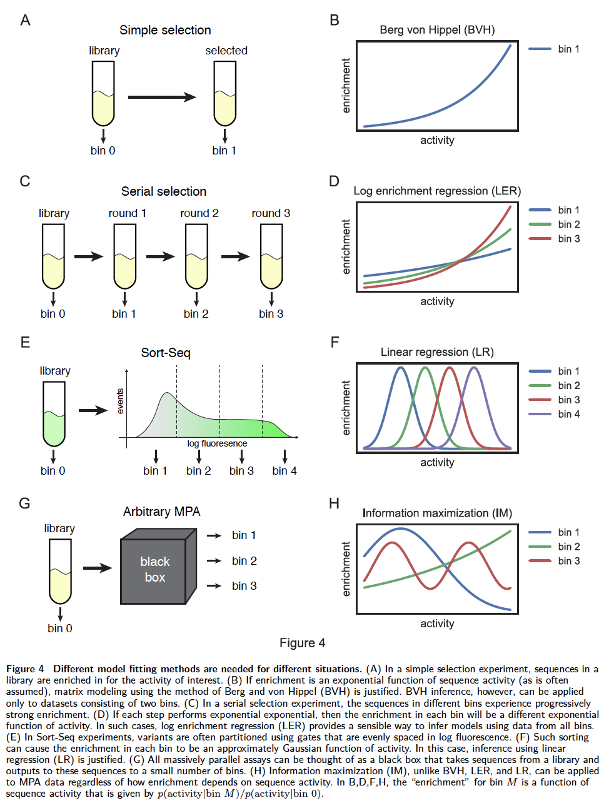

.. mpathic documentation master file, created by
   sphinx-quickstart on Mon Apr 23 09:37:52 2018.
   You can adapt this file completely to your liking, but it should at least
   contain the root `toctree` directive.

=======
MPAthic
=======

--------------------------------------------------------------------------------------
Quantitative Modeling of Sequence-function Relationships for Massively Parallel Assays
--------------------------------------------------------------------------------------

*Written by Ammar Tareen\*

.. raw:: html

    <h1>Under Active Development</h1>

MPAthic [#MPAthic2016]_ is a python API and it infers quantitative models from data.
Most MPAthic classes take in one or more tabular text files as input and return a tabular text file as output.
All input and output files are designed to be human readable. The first line of each tabular text file contains
headers describing the contents of each column. All input files are required to have the proper set of
columns, which of course depend on the command being executed. By default, input is taken from the standard
input and output is written to the standard output.

.. image:: _static/S0.png

Installation
------------

Prerequisites
~~~~~~~~~~~~~

MPAthic uses some Non-python resources and has the following prerequisites for installation:

* `GCC <https://gcc.gnu.org/>`_
   GCC, which contains both C compilers and Fortran compilers, is required to run MPAthic. From with in terminal, run the command gcc.
   ::

      $ gcc
      $ clang: error: no input files

   Check that gfortran was installed with gcc.
   ::

      $ gfortran
      $ gfortran: fatal error: no input files ...

* `NUMPY <http://www.numpy.org/>`_
   numpy is required to be installed before mpathic can be installed.
   ::

      pip install numpy

Install MPAthic
~~~~~~~~~~~~~~~

With the prerequisites installed, MPAthic can be installed using the pip (version 9.0.0 or higher) from
`PyPI <https://pypi.python.org/pypi/mpathic>`_. At the command line::

    pip install mpathic

The code for MPAthic is open source and available on
`GitHub <https://github.com/jbkinney/mpathic>`_. Some commonly encountered installation issues can be found here: :ref:`reference_label_install_issues`

Quick Start
-----------

The following snippets show how to use MPAthic from within python.
::

   import mpathic as mpa
   mpa.demo()

Resources
---------

.. toctree::
   :maxdepth: 2

   tutorial
   examples
   Documentation

Contact
-------

For technical assistance or to report bugs, please
contact `Ammar Tareen <tareen@cshl.edu>`_.

For more general correspondence, please
contact `Justin Kinney <jkinney@cshl.edu>`_.

Other links:

- `Kinney Lab <http://kinneylab.labsites.cshl.edu/>`_
- `Simons Center for Quantitative Biology <https://www.cshl.edu/research/quantitative-biology/>`_
- `Cold Spring Harbor Laboratory <https://www.cshl.edu/>`_

References
----------

.. [#MPAthic2016] William T. Ireland and Justin B. Kinney (2016) `MPAthic: quantitative modeling of sequence-function relationships for massively parallel assays <https://www.biorxiv.org/content/early/2016/06/20/054676>`_
   :download:`PDF <MPAthic2016.pdf>`.

.. _reference_label_install_issues:

Common Installation Issues
--------------------------

.. toctree::
   :maxdepth: 2

   install_issues

Indices and tables
------------------

* :ref:`genindex`
* :ref:`modindex`
* :ref:`search`
