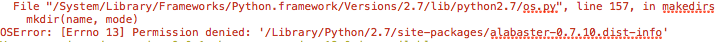

==========================================
Installation Issues
==========================================

Fortran Compiler
----------------

1. Missing Fortran compiler
~~~~~~~~~~~~~~~~~~~~~~~~~~~~

`pymc <https://docs.pymc.io/>`_ requires a fortran compiler in order to work. During installation, MPAthic will
look for existing fortran compilers on the user's machine. If none are present, the following error will be thrown:

.. image:: _static/install_issues_1.png

Fix
~~~
We recommend installing `GCC <https://gcc.gnu.org/install/>`_, as this satisfies both Non-Python MPAthic
dependencies (i.e. Cython and pymc). In addition to official instructions, GCC can be obtained easily on
macOS via `homebrew <https://brew.sh/>`_::

    brew install gcc

2. Updating gcc
~~~~~~~~~~~~~~~

Updates to gcc does not seem to update the paths required by pymc. An example is shown below
where the user initially installed gcc 4 but then updated to version 5:

Fix
~~~

Re-installing the version of gcc required by pymc (hence, mpathic) fixes this issue. In the case above, gcc version
4 was re-installed.

Cython
------

1. Existing Cython versions
~~~~~~~~~~~~~~~~~~~~~~~~~~~

2 Cython environment error
~~~~~~~~~~~~~~~~~~~~~~~~~~~

Fix
~~~
Run the anaconda command::

    conda install -c anaconda cython

Or pip install directly::

    pip install Cython==0.28.1

Permissions
-----------

The user might not have access to install to the global site-packages directory.

Fix
~~~
::

    pip install mpathic --user